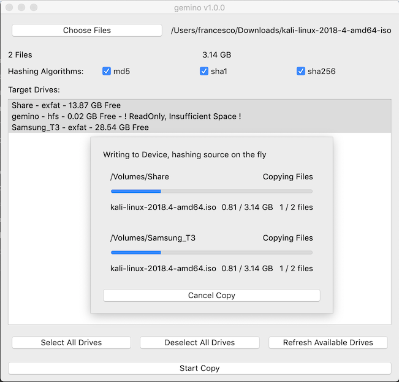
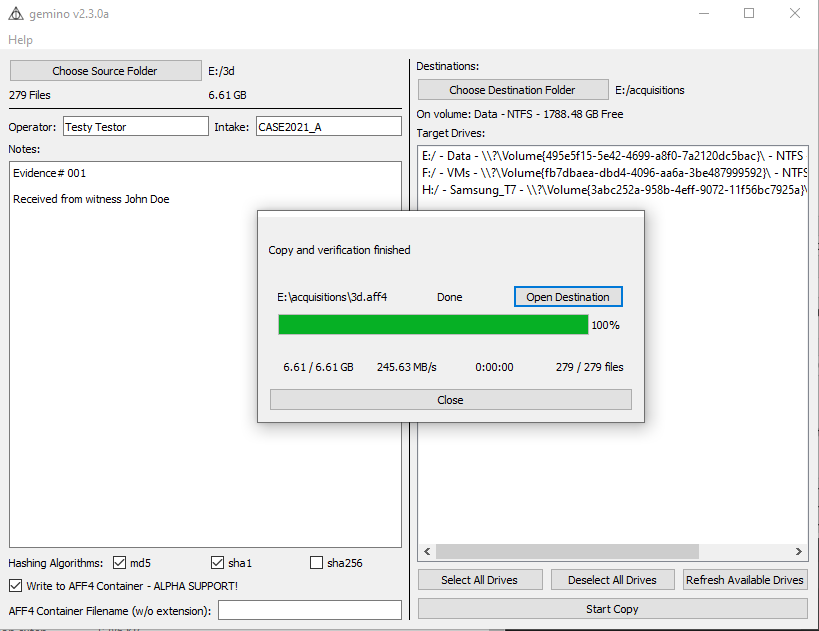

# gemino
## gemino file duplicator

Gemino is a file duplicator with advanced capabilities useful for copying forensics datasets.

This is born as a small project to help in my workflow, it could not suit all needs, and I 100% do not guarantee it to be bug free because, YOLO.

### Features

- **Read Once**: gemino reads the source data only once, even when copying to many sources
- **On the fly hashing**: gemino hashes the source data while copying
- **"Multicasting"**: gemino uses multiple threads to optimize the writing of the copies to the target drives
- **Verification**: gemino verifies the written data to the destination devices (well, what forensic tool would it be if that wasn't the case? ＼(￣▽￣)／	 )

Using gemino you can optimize the copy of large dataset to multiple drives for backup or distribution purposes.
By reading the source data only once gemino does not suffer from source bottlenecks.
Traditional copy by a script or via the OS GUI reads the source once for each destination;
with a parallel copy to many disks this means parallel reads which slow the overall performance.

Reading the source data only once for the entire process (copy and hashing) allows gemino to increase drastically the copy performance, especially on slow source devices such as Network drives or HDDs.

 

### Drawbacks
#### Copy Performance
Do not mix destination devices with different I/O - write speeds! The overall speed will be that of the slowest device!

gemino uses a *"multicast" like* approach, as such the data is read buffered from the source and sent to the destination disks in blocks of 64MB.
Each write process is independent for the block size (runs in a dedicate thread); however before passing to the next block all devices need to be finished with the write.
As such fast devices (eg. a USB SSD ~300/400MB/s) would have to wait that the buffer is copied to a slow device (eg. an USB Key ~50MB/s).

When copying ensure the target devices are as close as possible in terms of performance, better even if the same model.

#### Hash Verification Performance
Hash verification is for the moment implemented serially.
As hashing is a CPU bound operation multithreading in python would not be useful (all the threads are bound to the one and same core) (see **CPython implementation details** [here](https://docs.python.org/3/library/threading.html#thread-objects) for more information about that)
Solving this would need implementing multiprocessing, which will be for another time, feel free to submit a PR

### TODO

- Implement multiprocessing for hash verification.
- Clean up the mess that is this code.
- Make fbs work with the modularized version of the app.


### Installation & Running
#### From binaries
Just download the binaries for your system

- from github's [release page](https://github.com/fservida/gemino/releases).
- from fbs release system
  - macOS: [https://fbs.sh/fservida/gemino/gemino.dmg](https://fbs.sh/fservida/gemino/gemino.dmg)
  - windows: [https://fbs.sh/fservida/gemino/geminoSetup.exe](https://fbs.sh/fservida/gemino/geminoSetup.exe)
  - ubuntu: [https://fbs.sh/fservida/gemino/gemino.deb](https://fbs.sh/fservida/gemino/gemino.deb)
    - via apt with auto-updates:
    - ```
      sudo apt-get install apt-transport-https
      wget -qO - https://fbs.sh/fservida/gemino/public-key.gpg | sudo apt-key add -
      echo 'deb [arch=amd64] https://fbs.sh/fservida/gemino/deb stable main' | sudo tee /etc/apt/sources.list.d/gemino.list
      sudo apt-get update
      sudo apt-get install gemino
      ```

#### From source
**Python 3.5/3.6 Required** 
```
git clone https://github.com/fservida/gemino
cd gemino
pip install -r requirements.txt
fbs run
```


**Supported Platforms**
- macOS 10.14+ 
- Windows 10, 1803+

**Other Platforms**
This project uses  [fbs](https://build-system.fman.io/) for packaging, if binaries for your platform are not available (or compatible) you can just download the source and package it yourself.
Please share the packaged binary/installer (installer preferable) for others to use, we'll all be grateful (づ￣ ³￣)づ	.

### Contribution Guide

When submitting PRs please ensure your code is well commented, just like mine.
(just kidding, mine is a mess too)

### Feedbacks

Feel free to open issues and leave your feedback