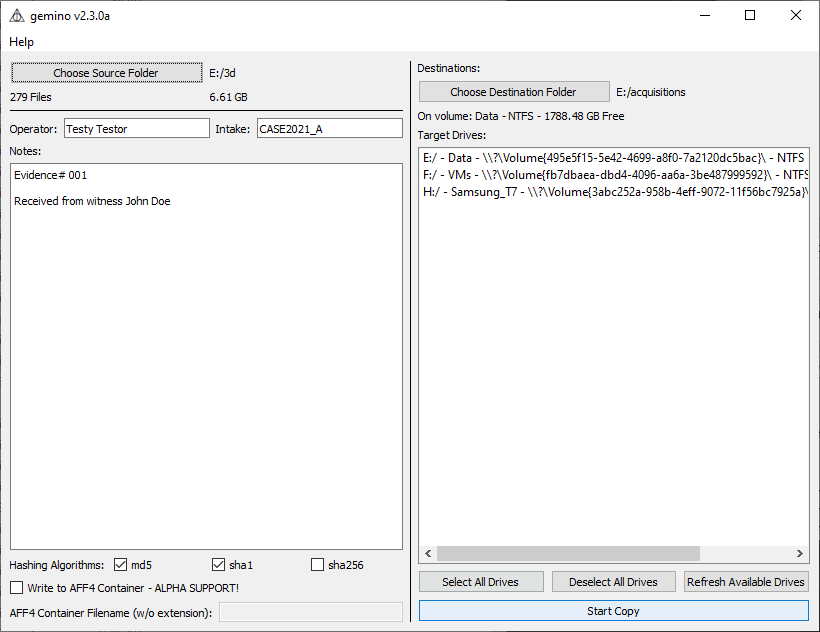
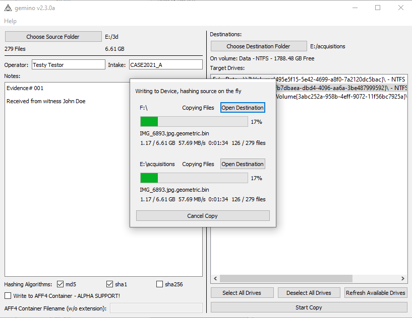
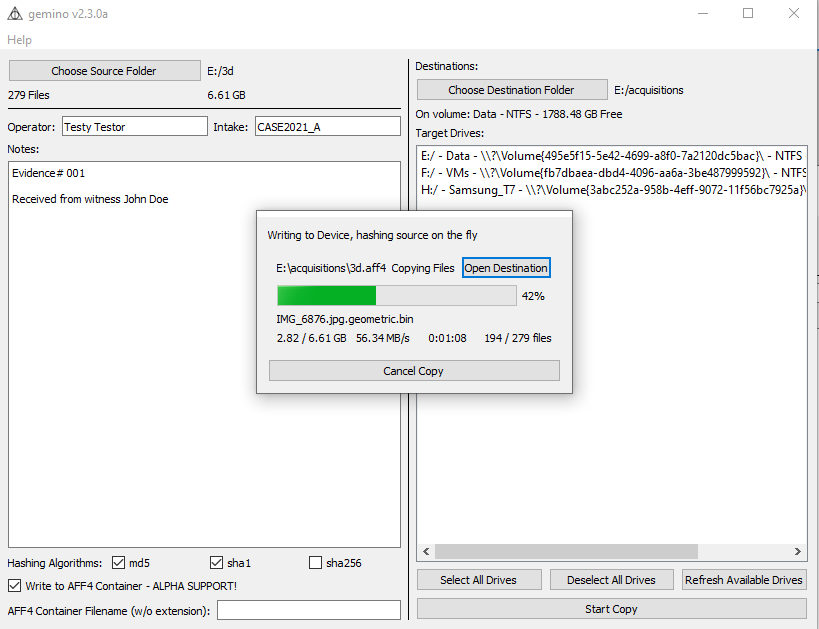
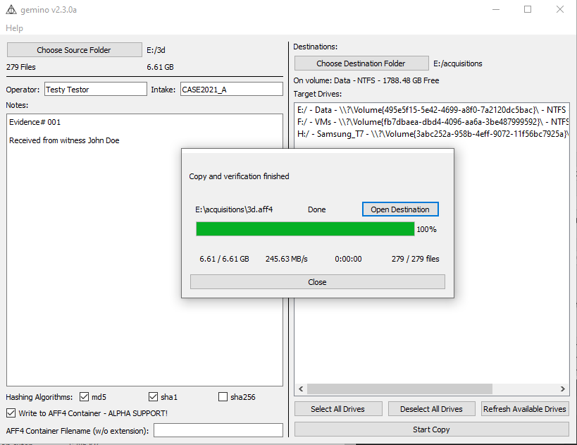
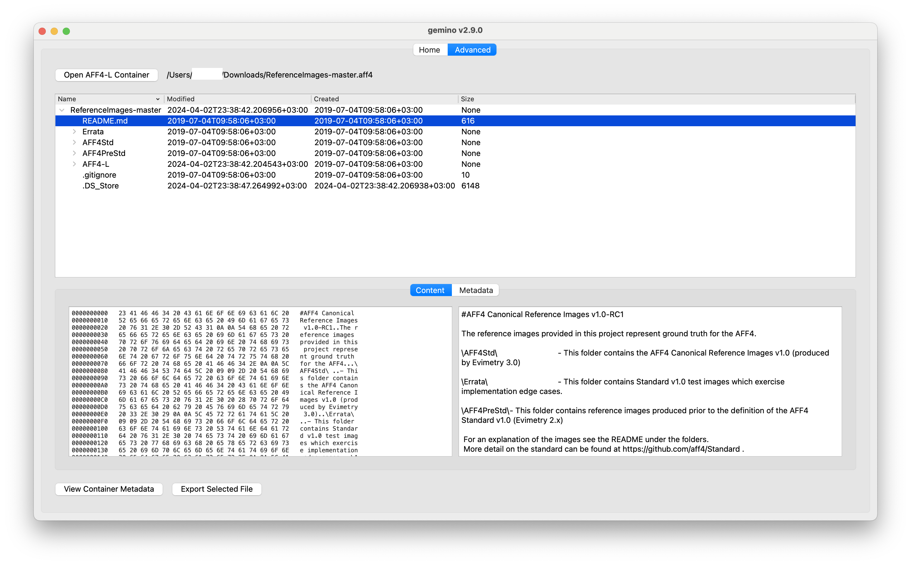

# gemino
[](https://github.com/fservida/gemino/actions/workflows/github-actions-package.yml)

<a href="https://apps.apple.com/us/app/gemino/id6478332524?mt=12&amp;itsct=apps_box_badge&amp;itscg=30200" style="display: inline-block; overflow: hidden; border-radius: 13px; width: 250px; height: 83px;"></a>

<a href="https://apps.microsoft.com/detail/gemino/9NWJQGNCPJPW?mode=full">
	
</a>

- [gemino](#gemino)
  - [gemino file duplicator](#gemino-file-duplicator)
    - [Features](#features)
    - [AFF4-L Support](#aff4-l-support)
    - [Drawbacks](#drawbacks)
      - [Copy Performance](#copy-performance)
      - [Hash Verification Performance](#hash-verification-performance)
    - [TODO](#todo)
    - [Installation \& Running](#installation--running)
      - [From binaries](#from-binaries)
      - [From source](#from-source)
    - [Contribution Guide](#contribution-guide)
    - [Feedbacks](#feedbacks)
    - [Privacy Policy](#privacy-policy)
      - [Collection of Personal Information](#collection-of-personal-information)
      - [Email](#email)
      - [Disclosure of Personal Information](#disclosure-of-personal-information)
      - [Contacting Us](#contacting-us)

## gemino file duplicator

Gemino is a file duplicator with advanced capabilities useful for copying forensics datasets and doing logical acquisitions.

This was born as a small project to help in my workflow, and has since evolved into a more complete tool with support for log files and forensic containers.

### Features

- **Read Once**: gemino reads the source data only once, even when copying to many sources
- **On the fly hashing**: gemino hashes the source data while copying
- **"Multicasting"**: gemino uses multiple threads to optimize the writing of the copies to the target drives
- **Verification**: gemino verifies the written data to the destination devices (well, what forensic tool would it be if that wasn't the case? ＼(￣▽￣)／	 )
- **AFF4**: Support for creation of AFF4 containers - Only one destination possible
- **AFF4**: Support for reading and verification of AFF4 containers - Simple preview interface available

Using gemino you can optimize the copy of large dataset to multiple drives for backup or distribution purposes.
By reading the source data only once gemino does not suffer from source bottlenecks.
Traditional copy by a script or via the OS GUI reads the source once for each destination;
with a parallel copy to many disks this means parallel reads which slow the overall performance.

Reading the source data only once for the entire process (copy and hashing) allows gemino to increase drastically the copy performance, especially on slow source devices such as Network drives or HDDs.




*Basic Copy to Multiple Destinations.*



*Copy to AFF4 Container for Single Destination.*



*Open AFF4 Container to preview and export content.*



### AFF4-L Support
#### Creation

1. The AFF4-L containers created with Gemino are compliant with standard published in [https://www.sciencedirect.com/science/article/pii/S1742287619301653](https://www.sciencedirect.com/science/article/pii/S1742287619301653)
2. The containers can be read and verified by pyaff tool
3. AFF4-L support has low compatibility by major forensic solutions of AFF4-L format.
4. To reduce impact due to point 3 the containers are created using only ZipSegments independently of file size to improve compatibility. If the tool does not support AFF4-L standard, or fails to process the data, the container can still be imported as ZIP archive.

    -   When imported this way the drawback will be inability to verify or process the metadata. Empty folders will also not be imported if using this workaround as they are not stored in the zip archive but only in the metadata file for AFF4-L.
    -   Containers with ZipSegments of arbitrary file sizes might be less performant as the whole segment needs to be loaded in memory when doing random seek, this approach was still chosen to ensure AFF4-L images created with Gemino have the widest possible compatibility with existing tools.

#### Verification and Reading

1. Gemino is able to verify and open AFF4-L containers created by gemino itself, pyAFF4 and Magnet Axiom.
2. Gemino has a basic viewer for containers featuring:

    - Directory like view of container
    - Hex Viewer for selected file
    - Preview for a limited number of document types (images, pdfs, plain text)
    - Metadata viewer for AFF4-L metadata and Exif metadata of images

### Drawbacks
#### Copy Performance
Do not mix destination devices with different I/O - write speeds! The overall speed will be that of the slowest device!

gemino uses a *"multicast" like* approach, as such the data is read buffered from the source and sent to the destination disks in blocks of 64MB.
Each write process is independent for the block size (runs in a dedicate thread); however before passing to the next block all devices need to be finished with the write.
As such fast devices (eg. a USB SSD ~300/400MB/s) would have to wait that the buffer is copied to a slow device (eg. an USB Key ~50MB/s).

When copying ensure the target devices are as close as possible in terms of performance, better even if the same model.

#### Hash Verification Performance
Hash verification is for the moment implemented serially.
As hashing is a CPU bound operation multithreading in python would not be useful (all the threads are bound to the one and same core) (see **CPython implementation details** [here](https://docs.python.org/3/library/threading.html#thread-objects) for more information about that)
Solving this would need implementing multiprocessing, which will be for another time, feel free to submit a PR

### TODO

- Implement multiprocessing for hash verification.
- Clean up the mess that is this code.


### Installation & Running
#### From binaries
Just download the binaries for your system

- from GitHub's [release page](https://github.com/fservida/gemino/releases).
- from [Apple Store](https://apps.apple.com/us/app/gemino/id6478332524) or [Microsoft Store](https://apps.microsoft.com/detail/gemino/9NWJQGNCPJPW?mode=full)

#### From source
**Python 3.9 Required** 
```
git clone https://github.com/fservida/gemino
cd gemino
pip install -r requirements.txt
python src/main/python/main.py
```
If having issues with running, please look at .github/workflows/github-actions-package.yml and check how we build for your OS.

On platforms with Apple Silicon use the following to create the needed environment for x64 binaries using rosetta (ensure rosetta is installed before by running any x64 binary):
```bash
CONDA_SUBDIR=osx-64 conda create -n rosetta python   # create a new environment called rosetta with intel packages.
conda activate rosetta
python -c "import platform;print(platform.machine())"
conda config --env --set subdir osx-64
```

**Supported Platforms**
- macOS 10.14+ 
- Windows 10, 1803+

**Other Platforms**
This project uses PyInstaller for packaging, if binaries for your platform are not available (or compatible) you can just download the source and package it yourself.
Please share the packaging commands for others to use, we'll all be grateful (づ￣ ³￣)づ	.

### Contribution Guide

When submitting PRs please ensure your code is well commented, just like mine.
(just kidding, mine is a mess too)

### Feedbacks

Feel free to open issues and leave your feedback

### Privacy Policy
By using "gemino" you are consenting to our policies regarding the collection, use and disclosure of personal information set out in this privacy policy.

#### Collection of Personal Information

We do not collect, store, use or share any information, personal or otherwise.

#### Email

If you email the developer for support or other feedback, the emails with email addresses will be retained for quality assurance purposes. The email addresses will be used only to reply to the concerns or suggestions raised and will never be used for any marketing purpose.

#### Disclosure of Personal Information

We will not disclose your information to any third party except if you expressly consent or where required by law.

#### Contacting Us

If you have any questions regarding this privacy policy, you can email gemino@francescoservida.ch
